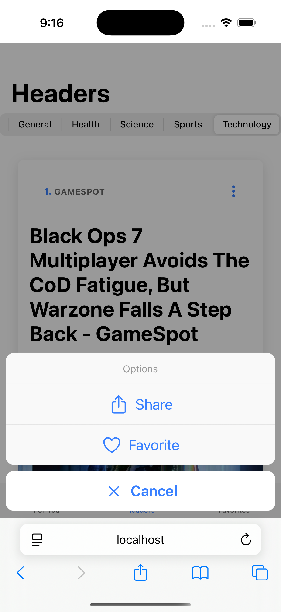

# News App Ionic

<!-- Demo Section -->
## 📱 Screenshots

<div align="center">
  <table>
    <tr>
      <td align="center">
        
        <br />
        <em>For You</em>
      </td>
      <td align="center">
        
        <br />
        <em>Headers</em>
      </td>
      <td align="center">
        
        <br />
        <em>Favorites</em>
      </td>
      <td align="center">
        
        <br />
        <em>Article Options</em>
      </td>
    </tr>
  </table>
</div>

---

A modern news application built with Ionic 8 and Angular 20, featuring the latest standalone components and Angular control flow syntax. This project demonstrates best practices for mobile app development with cross-platform capabilities.

## 📱 About

This news application is based on the course **"Ionic 6: Crear aplicaciones IOS, Android con Angular - 2019"** by Fernando Herrera, specifically from Section 8 "Aplicación de Noticias". However, this implementation has been completely modernized and updated to use:

- **Angular 20** with standalone components
- **Ionic 8** framework
- **Angular Control Flow** syntax (instead of ngIf/ngFor)
- **Modern TypeScript** patterns
- **Capacitor 7** for native functionality

🎓 **Course Link**: [Ionic 6: Crear aplicaciones IOS, Android con Angular](https://www.udemy.com/course/ionic-ios-android-pwa-appstore-playstore-push)

## ✨ Features

- 📰 **Top Headlines**: Browse the latest news from various sources
- 🏷️ **Category Filtering**: Filter news by different categories (business, technology, sports, etc.)
- ♾️ **Infinite Scroll**: Load more articles seamlessly
- 📱 **Responsive Design**: Optimized for mobile and tablet devices
- 🔗 **Article Sharing**: Share articles using native device capabilities
- 🌐 **Cross-Platform**: Runs on iOS, Android, and web browsers

## 🛠️ Tech Stack

- **Framework**: Ionic 8
- **Frontend**: Angular 20
- **Language**: TypeScript
- **HTTP Client**: Angular HttpClient
- **State Management**: RxJS Observables
- **Native Features**: Capacitor 7
- **News API**: NewsAPI.org

## 📋 Prerequisites

Before running this project, make sure you have:

- **Node.js** (version 18 or higher)
- **npm** or **yarn**
- **Ionic CLI** (`npm install -g @ionic/cli`)
- **Angular CLI** (`npm install -g @angular/cli`)

## 🚀 Getting Started

### 1. Clone the Repository

```bash
git clone https://github.com/ivanblueberry/ionic-news-app.git
cd ionic-news-app
```

### 2. Install Dependencies

```bash
npm install
```

### 3. Get Your News API Key

To fetch news data, you'll need a free API key from NewsAPI:

1. Visit [https://newsapi.org/](https://newsapi.org/)
2. Click on **"Get API Key"**
3. Create a free account
4. Copy your API key from the dashboard

### 4. Configure Environment

Update the environment file with your API key:

**File**: `src/environments/environment.ts`

```typescript
export const environment = {
  production: false,
  apiKey: 'YOUR_ACTUAL_API_KEY_HERE', // Replace with your NewsAPI key
  apiUrl: 'https://newsapi.org/v2'
};
```

**Important**: Also update `src/environments/environment.prod.ts` for production builds.

### 5. Run the Application

#### Development Server
```bash
ionic serve
```
The app will open at `http://localhost:8100`

#### Run on Mobile Device/Emulator

**For iOS:**
```bash
ionic capacitor add ios
ionic capacitor run ios
```

**For Android:**
```bash
ionic capacitor add android
ionic capacitor run android
```

## 📁 Project Structure

```
src/
├── app/
│   ├── components/           # Reusable UI components
│   │   ├── article/         # Individual article component
│   │   └── articles/        # Article list component
│   ├── interfaces/          # TypeScript interfaces
│   ├── pages/              # Application pages/tabs
│   │   ├── tab1/           # Top headlines page
│   │   ├── tab2/           # Categories page
│   │   ├── tab3/           # Favorites page
│   │   └── tabs/           # Tab navigation
│   └── services/           # Business logic services
│       └── news.ts         # News API service
├── environments/           # Environment configurations
└── theme/                 # Global styling
```

## 🎯 Key Components

### News Service (`src/app/services/news.ts`)
Handles all API communications with NewsAPI, including:
- Fetching top headlines
- Category-based news filtering
- Pagination and infinite scroll support

### Article Interfaces (`src/app/interfaces/index.ts`)
TypeScript interfaces for type-safe data handling:
- `NewsResponse`: API response structure
- `Article`: Individual news article
- `Source`: News source information

### Components
- **ArticlesComponent**: Displays a list of news articles
- **ArticleComponent**: Renders individual article cards

## 🔧 Available Scripts

```bash
# Development server
npm start

# Build for production
npm run build

# Run tests
npm test

# Lint code
npm run lint

# Build and watch for changes
npm run watch
```

## 📱 Build for Production

### Web Build
```bash
ionic build --prod
```

### Mobile Build
```bash
# iOS
ionic capacitor build ios

# Android
ionic capacitor build android
```

## 🤝 Contributing

1. Fork the repository
2. Create a feature branch (`git checkout -b feature/amazing-feature`)
3. Commit your changes (`git commit -m 'Add amazing feature'`)
4. Push to the branch (`git push origin feature/amazing-feature`)
5. Open a Pull Request

## 📄 License

This project is for educational purposes, based on Fernando Herrera's Ionic course. Please refer to the course materials for usage guidelines.

## 🙏 Acknowledgments

- **Fernando Herrera** - Original course creator and instructor
- **NewsAPI.org** - For providing the news data API
- **Ionic Team** - For the amazing cross-platform framework
- **Angular Team** - For the powerful frontend framework

## 📞 Support

If you have any questions or issues:

1. Check the [Ionic Documentation](https://ionicframework.com/docs)
2. Review [Angular Documentation](https://angular.io/docs)
3. Visit [NewsAPI Documentation](https://newsapi.org/docs)

---

**Note**: This is an educational project. The NewsAPI free tier has limitations for production use. Consider upgrading to a paid plan for production applications.
